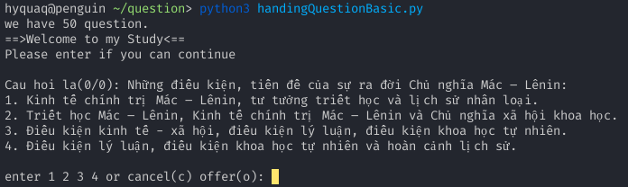
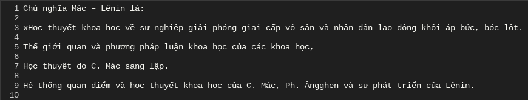
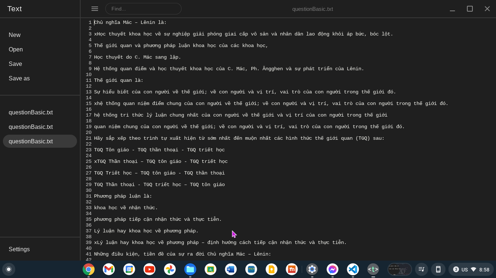

# Question
## Overview


- **Read**, handing and **store** data for use next time.
- **Remember** your answer.
- **Suggest** a lot of wrong sentences
- ...
## Install

### step1
Process the data in the following format
```
1 question
2 key1
3 key2
4 key3
5 key4
```
with the correct answer add ```x``` at the beginning of the sentence.
Here example.
```
Chủ nghĩa Mác – Lênin là: 
xHọc thuyết khoa học về sự nghiệp giải phóng giai cấp vô sản và nhân dân lao động khỏi áp bức, bóc lột. <-- correct answer
Thế giới quan và phương pháp luận khoa học của các khoa học, 
Học thuyết do C. Mác sang lập. 
Hệ thống quan điểm và học thuyết khoa học của C. Mác, Ph. Ăngghen và sự phát triển của Lênin. 
```
### step2
add all question to file ```questionBasic.txt```

**note**:
if you format question have ```\n``` the same picture above don't worry. **it's okey**.
after done it look like

### step3
